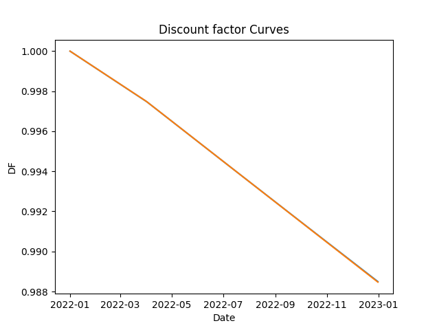
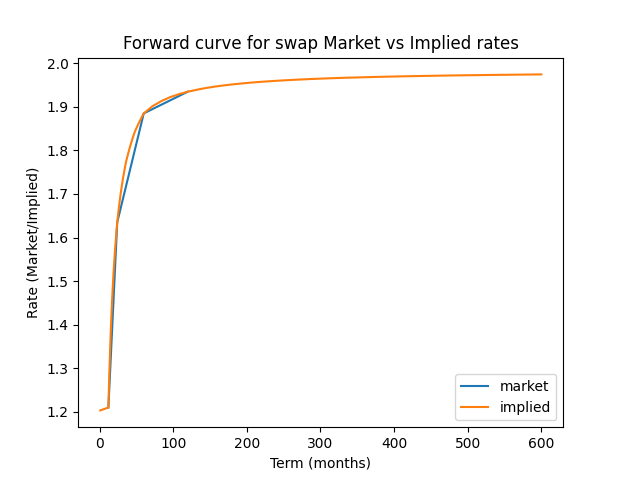

# SwapsQuantLib
Swaps Curve construction and Pricing library

### Running tests
#### Curve tests
```
python -m tests.curve_test   
python -m tests.curve_plot 
```


#### Schedule tests
```
python -m tests.schedule_test
```

#### Swap tests 
```
python -m tests.swap_test
python -m tests.swap_dual_curve_test
```


### Dual number tests 
```
python -m tests.dual_test
```

### Solved curve tests 
```
python -m tests.solvedcurve_test
```
