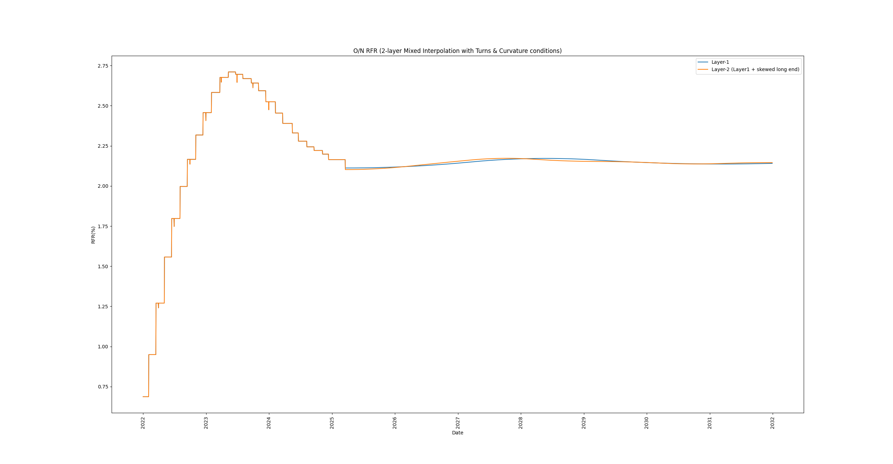
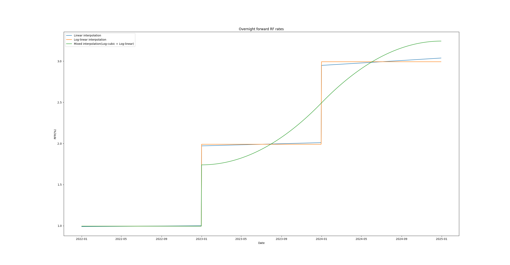
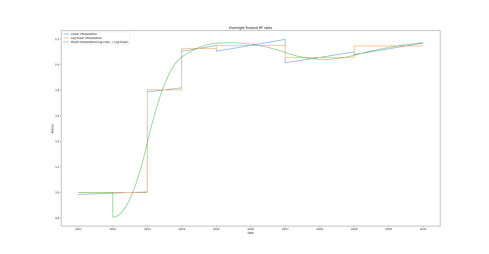
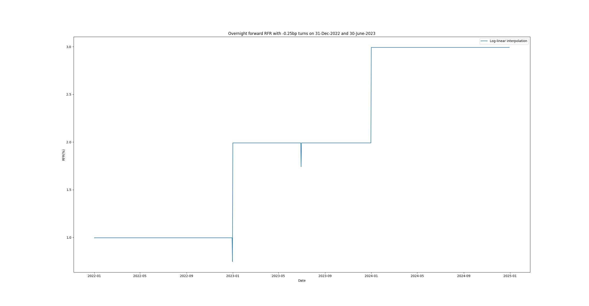
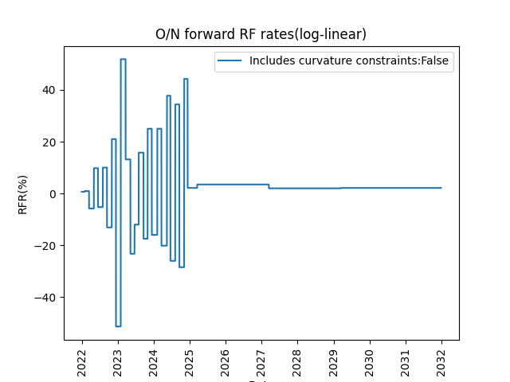
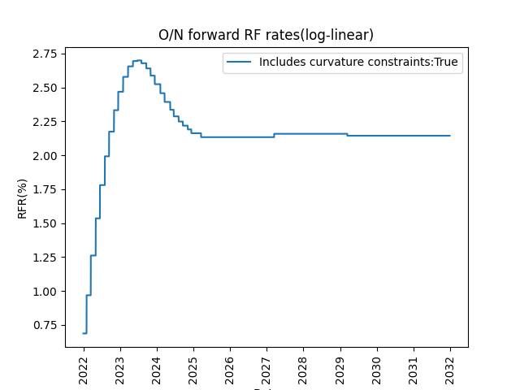
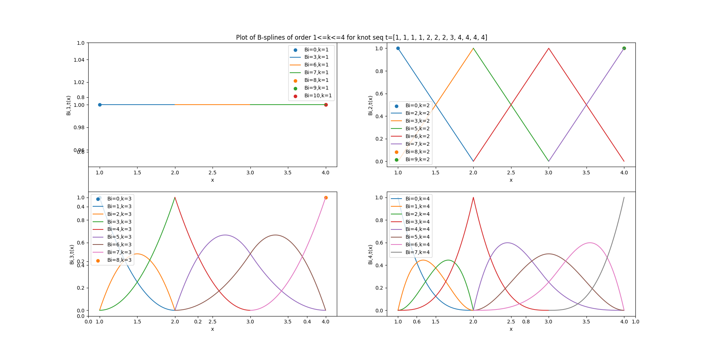
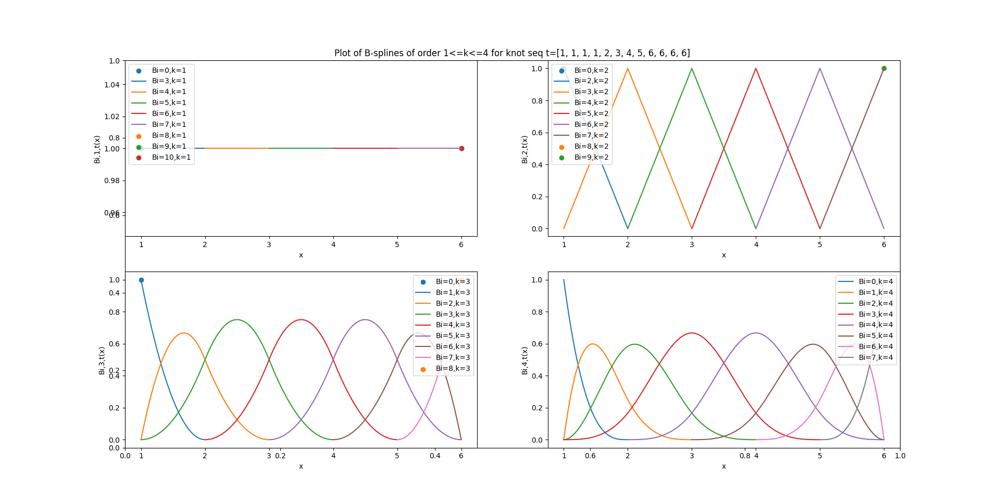
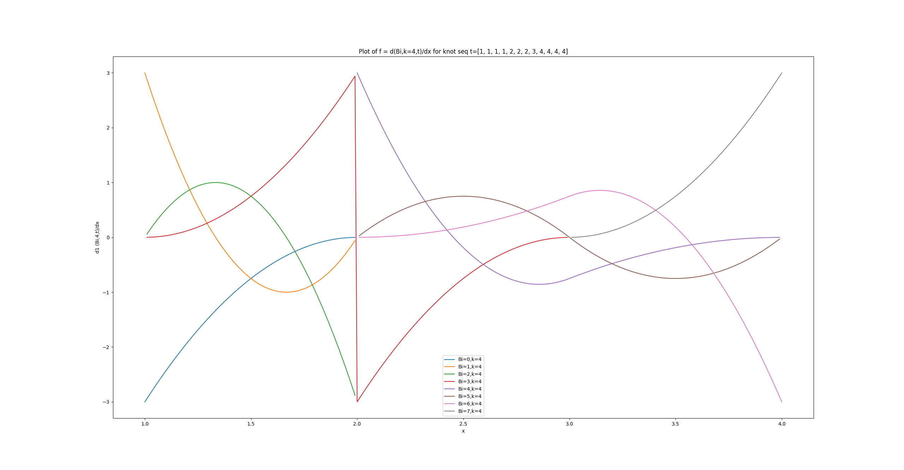

# SwapsQuantLib
A compact Python library for swap curve construction, discount curve calibration, and pricing using automatic differentiation with dual numbers.

## Features
- Calibrate discount curves to objective rates (liquid market swap rates) using:
  - `gradient_descent`
  - `gauss_newton`
  - `levenberg_marquardt`
- Interpolation modes:
  - **Log-linear** (flat between knots, step-wise)
  - **Linear** (piecewise linear with elbows at knots)
  - **Mixed** (cubic B-spline + log-linear fallback before first knot)
- Automatic Differentiation via custom `Dual` numbers to compute sensitivities and optimize efficiently.
- Swap and schedule support: build payment dates, fixed/float legs, and par-rate computations.

## Curve calibration and swap outputs
- **Log-linear** gives a flat rate between knots (step shape).
- **Linear** gives an upward slope between knots (straight line segments).
- **Mixed** gives a smooth curve between knots (B-spline) and falls back to log-linear before the first knot.

### Layered curve with Mixed cubic interpolation, turns and curvature constraints
- 1st-layer is built with Turns on meeting dates 
- Curvature constraint enforced as 2nd derivative = 0 on MPC dates via
  `SwapSpread(SwapSpread(mpc_1, mpc_2), SwapSpread(mpc_2, mpc_3)): 0`
- 2nd-layer swaps from 4y, 6y, 8y, 9y, 12y, 35y (skew adjustments on long end) are added using:
  - `skews_layer_2 = {Swap(...): value, ...}`

<table>
  <tr>
    <td><strong>3Y O/N RFR curve (mixed interpolation)</strong> </td>
    <td><strong>10Y curve example</strong> </td>
  </tr>
</table>

### Curves with turns on certain dates using SwapSpread instruments
- Use SwapSpread instrument to specify -0.25bp turn on 31-12-2022 and 30-06-2023

### Log-linear SONIA curves with turns and curvature constraints
- Turns on meeting dates
- Curvature constraint enforced as 2nd derivative = 0 on MPC dates via
  `SwapSpread(SwapSpread(mpc_1, mpc_2), SwapSpread(mpc_2, mpc_3)): 0`

<table>
  <tr>
    <td><strong>No curvature constraints</strong> </td>
    <td><strong>With curvature constraints</strong> </td>
  </tr>
</table>

## B-spline implementation (visible, all key plots)
- B-spline basis generation (orders 1–4)
- Repeated knot handling (smoothness reduction as expected)
- Derivative evaluation for B-spline curves

### Plot: B-splines (repeated knots)

### Plot: B-splines (no repeats)

### Plot: B-spline derivative (order 4)

## How to run tests
- Schedule path generation
  - `python -m tests.schedule_test`
- Swap pricing and swap curve tests
  - `python -m tests.swap_test`
  - `python -m tests.swap_dual_curve_test`
- Dual number unit tests
  - `python -m tests.dual_test`
- Solved curve & calibration tests
  - `python -m tests.solvedcurve_test`
- B-spline plots
  - `python -m tests.bspline_plot`

## Notes
- This repo is a functional prototype focused on curve construction and calibration; it is not intended as a production-grade implementation.
- Reference: "Pricing and Trading Interest Rate Derivatives" by JHM Darbyshire.

